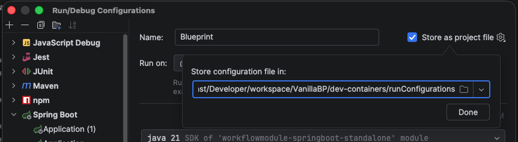

# dev-containers

Helper scripts to spin up one **isolated IntelliJ DevContainer per story**
on top of a multi-repo workspace.

**Clone this repository once, put it on your PATH, and use it for every
project.** The scripts themselves are project-agnostic; everything
project-specific lives in that project's own `devcontainers-config.json`.

Each story gets:

- a sibling workspace directory `workspace/<PROJECT_NAME>-<leaf>/`
- one git worktree per source repo
- a Dev Container (Java 21 + Maven + Node + Docker-in-Docker) with a
  preselected JetBrains backend, pre-wired run configs, port offset to
  run several stories in parallel, and a shared Claude-Code memory mount
- all Maven repos are built to ensure all dependencies are available
- Claude plugin Caveman installed (mode full)

## Files

| File / Directory          | Purpose                                                          |
|---------------------------|------------------------------------------------------------------|
| `spawn-workspace.sh`      | Create a new story workspace + DevContainer config from a branch (macOS/Linux) |
| `dispose-workspace.sh`    | Tear down a story workspace, its worktrees, and its container (macOS/Linux) |
| `spawn-workspace.ps1`     | Same as `spawn-workspace.sh`, for Windows PowerShell             |
| `dispose-workspace.ps1`   | Same as `dispose-workspace.sh`, for Windows PowerShell           |
| `env-config.sh`           | Loads `devcontainers-config.json` for the Bash scripts (needs `jq`)            |
| `EnvConfig.ps1`           | Loads `devcontainers-config.json` for the PowerShell scripts                   |
| `Common.ps1`              | Shared helper functions for the PowerShell scripts               |
| `devcontainers-config.json`             | **Per project, not part of this clone** → see "Per-project files" |
| `README.md.tpl`           | Default template for the welcome README placed at each new workspace root |
| `initialize.sh`           | Optional default hook run before the Maven warmup builds         |
| `runConfigurations/*.xml` | Default IntelliJ run configs copied into each new workspace      |
| `claude/statusline.sh`    | Optional Claude Code statusline (usage limits + Caveman badge); copy to `~/.claude/` → see below |

## Installation

Clone once, then add the directory to your PATH:

```sh
# macOS / Linux
git clone <url> ~/tools/dev-containers
ln -s ~/tools/dev-containers/spawn-workspace.sh   /usr/local/bin/
ln -s ~/tools/dev-containers/dispose-workspace.sh /usr/local/bin/
```

```powershell
# Windows
git clone <url> $HOME\tools\dev-containers
[Environment]::SetEnvironmentVariable('PATH',
    [Environment]::GetEnvironmentVariable('PATH','User') + ";$HOME\tools\dev-containers",
    'User')
```

The Bash scripts resolve symlinks, so the `ln -s` route works; PowerShell finds
`.ps1` files on the PATH, so `spawn-workspace.ps1 <branch>` (or even
`spawn-workspace <branch>`) works from any directory.

## Per-project files

Each project supplies its own `devcontainers-config.json`. Everything else is optional,
because the scripts fall back to the copies in this clone → so **a single
`devcontainers-config.json` in the project directory is a complete setup**:

```
<workspaces-root>/
├── <PROJECT_NAME>/
    ├── devcontainers-config.json                → minimal setup: this file alone is enough
    ├── <repo>/ …
```

or, if you prefer to keep it out of the project root and/or override some of
the defaults:

```
<workspaces-root>/
├── <PROJECT_NAME>/
    ├── dev-containers/
    │   ├── devcontainers-config.json            → required
    │   ├── README.md.tpl          → optional override
    │   ├── initialize.sh          → optional override
    │   ├── runConfigurations/     → optional override
    ├── <repo>/ …
```

The `devcontainers-config.json` is located in this order:

1. `--config <path>` → the file itself, or a directory containing `devcontainers-config.json`
2. `./dev-containers/devcontainers-config.json`, relative to the **current working directory**
3. `./devcontainers-config.json`, relative to the **current working directory**

Its directory is the **base directory** for the other project assets:
`README.md.tpl`, `initialize.sh` and `runConfigurations/` are read from there
and fall back to the copies shipped in this clone.

```sh
# from the project directory (finds ./dev-containers/devcontainers-config.json or ./devcontainers-config.json)
cd ~/work/myproject
spawn-workspace.sh feature/PRJ-4711_example-story

# or from anywhere, with an explicit config
spawn-workspace.sh --config ~/work/myproject/devcontainers-config.json feature/PRJ-4711_example-story
```

`devcontainers-config.json` is JSON with **full-line `//` comments** (JSONC). Trailing comments
after a value are *not* supported → put every comment on its own line.
See the copy in this repository for the full list of settings and what they do.

### Requirements

| Platform      | Needs                                                                 |
|---------------|-----------------------------------------------------------------------|
| macOS / Linux | `bash`, `git`, `jq`, Docker Desktop (or a Docker daemon)              |
| Windows       | Windows PowerShell 5.1 (or PowerShell 7), `git`, Docker Desktop       |

`jq` is only needed by the Bash scripts (`brew install jq` /
`apt-get install jq`); the PowerShell scripts parse `devcontainers-config.json` with built-ins
and need nothing installed.

### Windows

`spawn-workspace.ps1` / `dispose-workspace.ps1` are functionally equivalent to
their `.sh` counterparts, accept the same flags, and share the same
`devcontainers-config.json`. Run them from the IntelliJ terminal:

```powershell
spawn-workspace.ps1 feature/PRJ-4711_example-story
dispose-workspace.ps1 feature/PRJ-4711_example-story
```

Three differences are worth knowing about; the header comment of
`spawn-workspace.ps1` documents all of them in detail:

1. **Git worktree links are rewritten to relative paths.** Git for Windows
   writes `gitdir: C:/...` into a worktree's `.git` file, which Linux does not
   consider absolute → inside the container every worktree would be "not a git
   repository". The spawn script rewrites that pointer to a relative path and
   mounts the story workspace and the source workspace as siblings under
   `/workspaces`, so the same link resolves on the host **and** in the
   container. Git therefore works normally on both sides.
2. **The in-container workspace path is `/workspaces/<PROJECT_NAME>-<leaf>`**
   (the Bash version uses the constant `/workspaces/<PROJECT_NAME>`), which
   follows from point 1. Claude Code's shared memory is unaffected: the single
   host folder `~/.claude/projects/-workspaces-<PROJECT_NAME>/memory` is mounted
   onto this story's project key, so memory is still shared across all story
   containers → including ones spawned from macOS/Linux → while the conversation
   history stays per-story.
3. **SSH-agent forwarding is conditional.** The agent socket is only mounted
   when the Windows service `ssh-agent` ("OpenSSH Authentication Agent") is
   running. Enable it once with
   `Set-Service ssh-agent -StartupType Automatic; Start-Service ssh-agent`
   (needs admin) and re-spawn; otherwise ssh simply prompts for the key
   passphrase.

If PowerShell refuses to run the scripts with "running scripts is disabled on
this system", allow local scripts for your user once:

```powershell
Set-ExecutionPolicy -Scope CurrentUser RemoteSigned
```

### Mono-repo support

Put a `devcontainers-config.json` in the repository (either at its root or in a
`dev-containers/` subdirectory) and run the scripts from inside it:

```shell
my-mono-repo $ spawn-workspace.sh feature/my-awesome-feature
my-mono-repo $ dispose-workspace.sh feature/my-awesome-feature
```

The story workspaces become siblings of the repository, because the auto-detect
finds the directory named after `projectName` (the repository itself) and uses
its parent. Set `"workspacesRoot"` (or pass `--workspaces-root`) to put them
somewhere else.

Set `"repos": []` in `devcontainers-config.json`. The spawn script then operates in
**mono-repo mode**:

- It creates a single worktree at `<workspace>/<PROJECT_NAME>/` directly from
  the source workspace (the project directory itself), with no sub-directory lookup.
- If no build list (`builds` / `mavenBuilds`) is configured **and** a `pom.xml`
  exists at the project root, the script auto-populates a single
  `install` Maven build so the warmup runs without manual
  configuration.
- IntelliJ imports `$PROJECT_DIR$/<PROJECT_NAME>/pom.xml` as a single Maven
  project → equivalent to opening a classic single-module or multi-module Maven
  project.

Minimal `devcontainers-config.json` for a mono-repo (fill in the project-specific values):

```jsonc
{
    "projectName": "my-awesome-repo",
    "projectShort": "mar",
    // mono-repo: the source workspace IS the git repo
    "repos": [],
    // Build steps. Each "command" is a raw bash command run inside "repo"
    // (write "mvn ..." yourself). Omitting the key entirely, together with a
    // root pom.xml, auto-selects a single "install" Maven build. The
    // alternative "mavenBuilds" key instead treats each entry's "goal" as an
    // mvn goal ("$"-prefix = raw command); if both keys are present,
    // "mavenBuilds" wins.
    "builds": [],
    "hostPorts": [
        { "port": 8080, "label": "app" },
        { "port": 2222, "label": "ssh-tunnel" }
    ],
    "baseImage": "mcr.microsoft.com/devcontainers/java:1-21-bookworm",
    "nodeFeatureVersion": "24",
    "runConfigs": [],
    "forwardedEnvVars": []
}
```

### Rocky Linux / RHEL-family base (`distro`)

The default image family is Debian. Where Debian-based images are not allowed
(or simply not wanted), the scripts can build the container on
Rocky Linux 9 → or any RHEL-compatible base (Alma, CentOS Stream, UBI):

```jsonc
{
    "distro": "rocky",
    "baseImage": "rockylinux/rockylinux:9",
    "javaVersion": "21",        // dnf: java-21-openjdk-devel
    "mavenVersion": "3.9.9",    // Apache binary tarball -> /opt/maven
    "nodeFeatureVersion": "24"  // NodeSource setup_24.x
}
```

What changes under the hood:

| | `debian` (default) | `rocky` |
|---|---|---|
| Packages | `apt-get` | `dnf` |
| Toolchain | devcontainer features `git` / `java` / `node` / `docker-in-docker` | installed by the Dockerfile: `vscode` user, `java-<n>-openjdk-devel`, Maven tarball, Node from NodeSource (AppStream module as fallback), `docker-ce` from Docker's RHEL repo |
| `JAVA_HOME` | `/usr/lib/jvm/msopenjdk-current` | `/usr/lib/jvm/devcontainer-java` (symlink the build pins at the versioned JDK directory) |
| CA store | `update-ca-certificates` + `keytool` per JDK | `/etc/pki/ca-trust/source/anchors` + `update-ca-trust extract` (also regenerates the JDK truststore, so no `keytool` loop) |
| System rc file | `/etc/bash.bashrc` | `/etc/bashrc` |
| DinD | feature metadata (`privileged`, `init`, `/var/lib/docker` volume) | `--privileged`, `--init` in `runArgs` plus the same named volume, declared in `devcontainer.json` |
| Chromium | `chromium` from Debian | `epel-release` + `chromium`, symlinked to `/usr/bin/chromium` |

The devcontainer **features cannot be reused** on a RHEL base: every one of
them shells out to `apt-get` in its `install.sh`, so `"features"` is emitted
empty and the Dockerfile does the work instead.

One caveat:

- **git stays at the distro version** (2.43 on Rocky 9). There is no
  backports-style channel, so `imageBuild.recentGit` only upgrades within the
  enabled repos and prints a warning below 2.46 → the version the `glab`
  credential helper needs.

Both ports (`spawn-workspace.sh` and `spawn-workspace.ps1`) generate the same
files from the same `devcontainers-config.json`; `dispose-workspace.*` is distro-agnostic.

### Base-image caching (fast repeat builds)

Everything the generated Dockerfile installs (repo setup, base tooling,
JDK/Maven/Node, `docker-ce`, `socat`/`jq`/`sshd`, git upgrade, chromium, glab,
gh) is fully determined by `devcontainers-config.json` → nothing in it depends on the
story/branch name. Rebuilding all of that from scratch for every new
workspace can take 5-10 minutes, so `spawn-workspace.*` pre-builds it **once**
into a locally tagged image (`devcontainer-base:<distro>-<hash>`, the hash
covering the rendered Dockerfile plus the CA certs / Rocky repo files) and
collapses the workspace's own `.devcontainer/Dockerfile` down to a single
`FROM <tag>`. Later workspaces with an unchanged `devcontainers-config.json` hit the same
tag and the IDE's own `docker build` finishes in a second or two instead of
minutes.

A version bump, proxy change or cert update automatically changes the hash
(and therefore the tag), so it's always rebuilt when something that actually
matters changes. To force a rebuild without such a change (e.g. the internal
package mirror moved forward), either pass `--rebuild-base-image` to
`spawn-workspace.*` or just remove the tag manually:

```bash
docker rmi devcontainer-base:rocky-<hash>   # find the exact tag with: docker images
```

**Finding out which base images are stale:** every workspace's own
`.devcontainer/Dockerfile` still names the tag it was built from
(`FROM devcontainer-base:...`), even after the heavy install steps were
collapsed away. `prune-base-images.ps1` / `prune-base-images.sh` scan every
workspace under `<workspaces-root>/<PROJECT_NAME>-*` for that `FROM` line,
diff it against the locally cached `devcontainer-base:*` images, and offer to
remove whatever no workspace references anymore (typically leftovers from
disposed workspaces or from a devcontainers-config.json change that moved everyone onto a
newer tag):

```bash
prune-base-images.sh            # lists orphaned images, asks to confirm
prune-base-images.sh --yes      # same, no prompt (e.g. for a cron job)
```

### GitLab integration is optional

GitLab integration kicks in only when **both** `glabHostname` **and**
`glabVersion` are non-empty in `devcontainers-config.json`. With either left empty the
spawn script:

- skips the `glab` install in the Dockerfile,
- skips the bind-mount of the host's glab-cli config,
- skips the git credential helper setup for the GitLab host,
- skips the glab-related section in the generated workspace README.

The mechanism is `__GLAB_BLOCK_START__` / `__GLAB_BLOCK_END__` marker
pairs in the heredoc templates inside `spawn-workspace.sh`. When enabled
just the marker lines are stripped (content stays); when disabled both
the markers and the content between them are dropped.

### IntelliJ run configurations

`runConfigurations/` holds the XMLs that end up in
`<new-workspace>/.idea/runConfigurations/`. The `runConfigs` array in
`devcontainers-config.json` lists which files get copied (in order). The directory is looked
up next to `devcontainers-config.json` first and falls back to the one in this clone, so a
project ships its own run configs by adding
`<project>/dev-containers/runConfigurations/`. The XMLs may use the
placeholders for host ports defined in `devcontainers-config.json`
(e.g. `__PORT_4200__`, `__PORT_8080__`) → the spawn scripts substitute them
to the actual port-offsetted host ports when copying.

To add/change run configs:
1. Drop a new XML into the project's `runConfigurations/` (or edit an existing one).
2. Add its filename to `runConfigs` in `devcontainers-config.json`.

*Hint:* To get an XML from an existing run configuration one can use the
`store as project file` feature:



**Avoid `$PROJECT_DIR$` in run config fields passed to external processes.**
In JetBrains Gateway's ijent/Eel mode (2025.x+), `$PROJECT_DIR$` expands to
a virtual Eel path (`/$devcontainer.ij/<hash>@/…`) which IntelliJ uses
internally but which real processes (JVM, shell) cannot resolve. Use
`__WORKSPACE_PATH__` instead → the spawn scripts substitute it to the
literal container path when copying the XML.

### Corporate proxy and TLS interception

Behind a corporate proxy, three separate things have to be solved. They are
independent → most setups need only some of them.

**1. Pulling the base image and the features (Docker daemon).**
This is *not* controlled by `devcontainers-config.json`; the daemon does the pulling.
Configure it in **Docker Desktop → Settings → Resources → Proxies**. Docker
Desktop's "system proxy" mode does not evaluate a PAC file that is published via
`AutoConfigURL`, so a manual entry is usually required.

Note that Docker Desktop authenticates against a proxy with **Basic** out of the
box. **Kerberos/NTLM requires a Docker Business subscription** and the
`--proxy-enable-kerberosntlm` installer flag. If your proxy only offers NTLM (you
can check with the snippet below) and you don't have Business, you need a local
proxy that performs the authentication for you → Fiddler, `px` or `cntlm` → and
point Docker Desktop at that.

```powershell
# Which authentication schemes does the proxy offer?
$c = New-Object Net.Sockets.TcpClient('your-proxy', 8080); $s = $c.GetStream()
$b = [Text.Encoding]::ASCII.GetBytes("CONNECT example.com:443 HTTP/1.1`r`nHost: example.com:443`r`n`r`n")
$s.Write($b,0,$b.Length); Start-Sleep 1; $buf = New-Object byte[] 2048
[Text.Encoding]::ASCII.GetString($buf,0,$s.Read($buf,0,2048)) -split "`r`n" |
    Select-String 'HTTP/|Proxy-Authenticate'
```

**2. The image build and the running container (`devcontainers-config.json`).**
Add a `proxy` block; every key is optional:

```jsonc
"proxy": {
    // Docker Desktop's own forwarder, reachable from every container and
    // inheriting whatever is configured under Settings -> Resources -> Proxies
    // (including the exclusion list). Alternative: a proxy on the host via
    // "http://host.docker.internal:<port>". Never "127.0.0.1" - inside a
    // container that would be the container itself.
    "http":  "http://http.docker.internal:3128",
    "https": "http://http.docker.internal:3128",
    // Always exclude internal registries so they are contacted directly.
    "noProxy": "localhost,127.0.0.1,*.example.lan",
    "caCertificates": [ "certs/corporate-root-ca.crt" ],
    "debianUseHttps": true
}
```

Note that Docker Desktop's proxy setting covers **image pulls by the daemon
only** → it does not inject `HTTP_PROXY` into builds or running containers
(verified). That is exactly what this block is for.

- `http`/`https`/`noProxy` are passed to the build as build args **and** to the
  running container via `containerEnv`, in upper- and lowercase spelling.
- `debianUseHttps` rewrites the Debian/Ubuntu apt sources from `http://` to
  `https://` before the first `apt-get` → many proxies forward `CONNECT` but
  refuse plain-HTTP relaying. With `"distro": "rocky"` the same switch disables
  the Rocky mirrorlist (its mirrors are mostly plain HTTP) and pins the
  `https://` baseurl instead. Distro-neutral alias: `useHttpsRepos`.

**3. TLS interception / internal certificate authorities (`caCertificates`).**
This is needed far more often than people expect, and not only for intercepting
proxies: if your **internal registry** (Nexus, Artifactory) uses a certificate
from your company CA, containers cannot talk to it either → the base image only
trusts public CAs. Symptoms are `self-signed certificate in certificate chain`
(curl/npm), `PKIX path building failed` (Maven) and `certificate signed by
unknown authority` (Go tools).

Listing the certificates makes the spawn scripts copy them into the workspace's
`.devcontainer/certs/`, and the generated image installs them into **all three**
trust stores that matter:

| Trust store | Used by | How |
|---|---|---|
| OS bundle | curl, apt/dnf, git, wget | `update-ca-certificates` (Debian) / `update-ca-trust extract` (Rocky) |
| JVM truststore | **Maven**, Gradle | `keytool -importcert` into `$JAVA_HOME/lib/security/cacerts` (Debian). On Rocky the JDK's `cacerts` is a symlink into the extracted ca-trust store, so `update-ca-trust` already covers it |
| Node | **npm** | `NODE_EXTRA_CA_CERTS` |

Maven and npm are the ones people trip over: neither uses the OS bundle.

Usually the **root** CA alone is enough → servers send their intermediates
during the handshake. Export it from the Windows certificate store:

```powershell
# List candidates (look for your company's root CA)
Get-ChildItem Cert:\LocalMachine\Root | Where-Object Subject -match 'YourCompany' |
    Select-Object Subject, Thumbprint, NotAfter

# Export one as PEM next to your devcontainers-config.json
$c = Get-Item Cert:\LocalMachine\Root\<THUMBPRINT>
$pem = "-----BEGIN CERTIFICATE-----`n" +
       [Convert]::ToBase64String($c.RawData,'InsertLineBreaks') +
       "`n-----END CERTIFICATE-----`n"
[IO.File]::WriteAllText("certs\corporate-root-ca.crt", $pem -replace "`r`n","`n")
```

On macOS/Linux the equivalent is
`security find-certificate -a -p -c "<CA name>" /Library/Keychains/System.keychain > certs/corporate-root-ca.crt`
or simply copying the `.crt` your IT department provides.

**A caveat worth checking early.** Some web gateways block whole *media types*
rather than hosts → archives such as `.tgz`, `.jar`, `.gz` and `.deb` are a
common policy target. The symptom is a `403` with a body like
`MediaTypeBlocked`, while plain metadata requests to the same host return `200`.
No proxy or certificate configuration can work around that: `apt-get`,
`npm install` from the public registry and Maven Central are then simply
unavailable, and everything has to come from an internal mirror. To check:

```sh
curl -o /dev/null -w '%{http_code}\n' https://registry.npmjs.org/lodash          # metadata
curl -o /dev/null -w '%{http_code}\n' https://registry.npmjs.org/lodash/-/lodash-4.17.21.tgz  # archive
```

If the second one is `403`, point `baseImage` at your internal registry mirror,
make sure `~/.npmrc` and `~/.m2/settings.xml` use the internal repository (they
are carried into the container by these scripts), and have your registry
administrators add proxy repositories for anything still missing.

### Optional image build steps

Three steps of the generated Dockerfile need a distribution package mirror. On a
network where `apt`/`dnf` cannot reach one (see the media-type caveat above),
turn them off individually:

```jsonc
"imageBuild": {
    "packages": false,      // socat, jq, openssh-server ("aptPackages" also accepted)
    "recentGit": false,     // current git from backports / PPA
    "chromium": false       // Chromium for bpmn-to-image
}
```

Each switch defaults to `true`, so omitting the block keeps the full image.
What you give up:

| Off | Consequence |
|---|---|
| `packages` | No docker-over-TCP fallback on `127.0.0.1:2375`, and **no sshd** → the IntelliJ Database tunnel is unavailable. The Claude statusline loses its usage segment (needs `jq`). `post-start.sh` detects this and skips those steps with a note instead of failing. |
| `recentGit` | The base image's git is used. Only matters for the glab credential helper, which needs git 2.46+. |
| `chromium` | `bpmn-to-image` is not installed either → it cannot render without a browser. On Rocky it also skips pulling in EPEL. |

With `"distro": "rocky"` these switches only cover the *optional* extras. The
base tooling (`sudo`, `git`, `tar`, the `vscode` user, JDK, Maven, Node, docker)
is installed unconditionally → without it the container cannot run at all.

Related, `featureRegistry` redirects the devcontainer features to a mirror
(Debian only → the Rocky image is built without any feature):

```jsonc
"featureRegistry": "nexus.example.lan/docker-ghcr-io"
```

Be aware that this only changes where the feature *packages* come from. The
features still download their payload from the internet while the image is
built → the node feature fetches Node from nodejs.org, the java feature uses
SDKMAN, several run `apt-get`. A genuinely offline build needs mirrors for
those too.

### Optional initialization hook

If an `initialize.sh` exists next to `devcontainers-config.json` (or, as a fallback, in this
clone), the spawn scripts copy it into the new workspace's `.devcontainer/` and
`post-create.sh` runs it **before** the Maven warmup builds, with the workspace
root as the working directory.

Use it for one-time setup that must precede Maven dependency resolution →
for example starting a Docker service that hosts an artifact proxy, seeding a
local registry, or pulling Docker images while the network is still available.

The file is opt-in: add `initialize.sh` to the project's `dev-containers/`
directory to activate the hook for all future spawns of that project.

### Workspace welcome README

The README placed at each new workspace root (the "First-time setup" /
"Running the stack locally" steps) comes from `README.md.tpl`. Put a copy next
to the project's `devcontainers-config.json` to customise it per project; otherwise the
default in this clone is used. It uses the same `__PLACEHOLDER__` /
`__GLAB_BLOCK__` mechanism as the other templates.

## Prerequisites

### Host machine

- **macOS** (tested) or Linux. Docker Desktop on macOS provides the
  bind-mount / ssh-agent forwarding magic the scripts rely on.
- **Docker Desktop** (or `docker` + `docker compose` plugin) running.
- **IntelliJ IDEA Ultimate** (≥ 2025.3) with **JetBrains Gateway** enabled
  for Dev Container connections.
- **Bash 4+** (macOS' default `/bin/bash` 3.2 is fine for the spawn script;
  newer is not required).
- **Git** with worktree support (any modern version).
- **`~/.ssh`** populated and (optionally) an ssh-agent running on the host →
  the container forwards the agent socket so passphrase-protected keys work
  without prompting.
- **`glab` login** (only needed when GitLab integration is enabled in
  `devcontainers-config.json`): `glab auth login --hostname <glabHostname>`. The config is
  bind-mounted into the container so the login flows in both directions.

### Workspace layout the scripts assume

```
<workspaces-root>/
├── <PROJECT_NAME>/                         → source workspace (READ by spawn)
│   ├── devcontainers-config.json                         → the project's config (or in dev-containers/)
│   ├── project-a/                    .git  → each is a normal git repo
│   ├── project-b/                    .git
├── <PROJECT_NAME>-<branch-leaf>            → created by spawn-workspace
    ├── project-a/                    .git  (worktree of source)
    ├── …
    ├── .devcontainer/                      DevContainer build + config
```

If any source repo is missing, the corresponding worktree is silently
skipped → the workspace still spawns with the rest.

### Resolving `<workspaces-root>`

Both scripts (and their `.ps1` counterparts) pick the workspaces root in this priority order:

1. **`--workspaces-root <path>`** CLI flag → highest priority, overrides everything.
2. **`$<PROJECT_SHORT>_WORKSPACES_ROOT`** environment variable (PowerShell:
   `$env:<PROJECT_SHORT>_WORKSPACES_ROOT`) → handy for a one-off shell.
3. **`"workspacesRoot"` in `devcontainers-config.json`** → the portable, per-project choice.
   A relative value is resolved against the config file's own directory
   (e.g. `"workspacesRoot": ".."`), so it can be committed and still work on
   every machine.
4. **Auto-detect** → the scripts walk up from the config's directory looking for
   the directory named `<PROJECT_NAME>` (that is the source workspace) and take
   its parent. This covers both layouts shown above without any configuration.
   If no such directory is found, the fallback is two levels above the config.

Each invocation prints the resolved target directory and asks for
confirmation before doing anything. Press Enter to accept, type `n` to
abort. Pass `--yes` (or `-y`) to skip the prompt in scripted runs.

## Usage

### Create a workspace

```sh
spawn-workspace.sh [--config <path>] [--workspaces-root <path>] [--yes] <branch-name>
```

```powershell
spawn-workspace.ps1 [--config <path>] [--workspaces-root <path>] [--yes] <branch-name>
```

Base refs for new branches are not on the CLI → each repo brings its own
`baseRef` in the `repos` list in `devcontainers-config.json`.

A `repos` entry with an **empty `baseRef`** (e.g.
`{ "name": "backlog.md", "baseRef": "" }`) is not a
git repo: no worktree is created → the host directory is bind-mounted into the
workspace at the same path instead. Use it for pre-built artifacts or other
non-versioned folders that must be visible/buildable in the container. Disposing
the workspace leaves the host source untouched.

Examples:

```sh
# Branch already exists locally or on origin -> reuses / tracks it
spawn-workspace.sh feature/PRJ-4711_example-story

# Brand-new branch: each repo forks from its own configured base ref
spawn-workspace.sh feature/PRJ-4711_new-story

# Explicit config -> runnable from any directory (file or its directory)
spawn-workspace.sh --config ~/work/myproject/dev-containers feature/PRJ-4711_new-story

# Point at a non-default workspaces directory (one-shot override)
spawn-workspace.sh --workspaces-root /opt/dev feature/PRJ-4711_new-story

# Same, but via env var (set it once in your shell profile)
export PRJ_WORKSPACES_ROOT=/opt/dev # PRJ is <PROJECT_SHORT>
spawn-workspace.sh feature/PRJ-4711_new-story

# Skip the confirmation prompt (CI / batch use)
spawn-workspace.sh --yes feature/PRJ-4711_new-story
```

Open the new workspace in IntelliJ via **JetBrains Gateway → Dev Containers →
From local project** and point it at the workspace's `.devcontainer/`
directory. Step-by-step first-time setup is in the generated workspace's
own `README.md`.

What it does:

1. Locates `devcontainers-config.json` (`--config` → `./dev-containers/devcontainers-config.json` →
   `./devcontainers-config.json`), then
   resolves the workspaces root (CLI flag → env var → auto-detect), prints the
   target directory and prompts for confirmation. Aborts if you answer `n` or
   if the target already exists.
2. Computes the branch leaf (strips `feature/` etc.) → workspace name
   `<PROJECT_NAME>-<leaf>`.
3. Probes host ports and picks the lowest free
   multiple of `portOffsetStep` (default 10000, configurable in `devcontainers-config.json`,
   range 500..10000) as the **port offset** (so parallel stories never
   collide on host ports). The probe treats a host port as taken when a live
   listener holds it, when another story workspace's `devcontainer.json`
   statically maps it, or when any docker container binds it → including
   stopped containers and containers of unrelated projects.
4. Creates one git worktree per source repo with the requested branch
   (reused, tracked, or → for brand-new branches → forked from the
   per-repo `baseRef` defined in `repos`). On Windows the worktree link file
   is additionally rewritten to a relative path so git works on the host and
   inside the Linux container alike.
5. Writes a `.devcontainer/` (Dockerfile + devcontainer.json + post-create
   hooks) into the new workspace, plus `.idea/` (project name, JDK,
   run configs, README.md) and a per-story `.claude/` overlay. Read it
   to learn about host mounts and other details.
6. Sets `core.fileMode=false`, `core.autocrlf=input`, `core.checkStat=minimal`
   and `core.trustctime=false` in each source repo so the bind-mounted
   worktree doesn't trigger stale-stat rebase failures inside the container.

*Hint:* Read the head of the script for a detailed list of features and 
their documentation.

### Dispose a workspace

```sh
dispose-workspace.sh [--config <path>] [--workspaces-root <path>] [--force] [--delete-branch] [--keep-container] [--keep-image] [--yes] <target>
```

```powershell
dispose-workspace.ps1 [--config <path>] [--workspaces-root <path>] [--force] [--delete-branch] [--keep-container] [--keep-image] [--yes] <target>
```

Examples:

```sh
# Default: refuse if any worktree is dirty, keep branch, remove container + volumes + image
dispose-workspace.sh feature/PRJ-4711_example-story

# Also delete the local branch from each source repo
dispose-workspace.sh --delete-branch feature/PRJ-4711_example-story

# Force-remove despite uncommitted changes (you lose them)
dispose-workspace.sh --force feature/PRJ-4711_example-story

# Leave the Docker container alone (IntelliJ still has it open)
dispose-workspace.sh --keep-container feature/PRJ-4711_example-story

# Remove container and volumes but keep the image layer cache for a faster next rebuild
dispose-workspace.sh --keep-image feature/PRJ-4711_example-story

# Use the Docker container name or ID instead of the branch
dispose-workspace.sh PRJ-PRJ-4711_example-story
dispose-workspace.sh a3f2b1c4d5e6

# Explicit config -> runnable from any directory
dispose-workspace.sh --config ~/work/myproject/dev-containers feature/PRJ-4711_example-story

# Non-default workspaces root via flag or env var
dispose-workspace.sh --workspaces-root /opt/dev feature/PRJ-4711_example-story
PRJ_WORKSPACES_ROOT=/opt/dev dispose-workspace.sh feature/PRJ-4711_example-story  # PRJ = <PROJECT_SHORT>

# Skip the confirmation prompt
dispose-workspace.sh --yes feature/PRJ-4711_example-story
```

Accepts any of: full branch name (`feature/PRJ-…`), branch leaf (`PRJ-…`),
workspace directory name (`<PROJECT_NAME>-PRJ-…`), Docker container name
(`<PROJECT_SHORT>-PRJ-…`), or Docker container ID (hex, ≥12 chars).

The workspace/container prefixes are only stripped when that actually yields an
existing workspace, so a branch whose leaf legitimately starts with the project
name (project `PRJ`, branch `feature/PRJ-4711` → workspace `PRJ-PRJ-4711`)
resolves correctly.

What it does:

1. Checks every worktree for uncommitted changes. Aborts unless `--force`.
2. Removes each git worktree from its source repo's metadata.
3. Optionally deletes the local branch from each source repo.
4. Removes the Docker container `<PROJECT_SHORT>-<leaf>`, all its named
   volumes, and the devcontainer image (unless `--keep-container`; use
   `--keep-image` to skip only the image removal).
5. Removes the workspace directory.

*Hint:* Read the head of the script for a detailed list of features and
their documentation.

## Claude Code usage statusline

An optional host-side statusline that shows your Claude Code usage limits and
keeps the Caveman badge. It renders, left to right:

```
[CAVEMAN]  Opus 4.8 (1M) | Sitzung 24% | Woche 41%
```

- **Sitzung** → the rolling **5-hour** window (`rate_limits.five_hour`).
- **Woche** → the **7-day / weekly** window across all models
  (`rate_limits.seven_day`).

The limit fields are only present for Claude.ai Pro/Max subscribers, and only
**after the first API response** of a session → until then only the badge and
model name show, which is expected.

**Why it also works inside every story container:** `spawn-workspace.sh`
bind-mounts the host `~/.claude` into each container
(`~/.claude` → `/home/vscode/.claude`), so `settings.json` and the statusline
script are shared automatically → set it up once on the host and every story
container inherits it. The one runtime dependency is `jq`, which the
DevContainer image installs (see the package-install line in the generated
`Dockerfile`). Rebuild an existing container to pick up `jq`; new spawns have
it out of the box.

### Setup

1. Copy the ready-made [`claude/statusline.sh`](claude/statusline.sh) from this
   repo to `~/.claude/statusline.sh` and make it executable:

   ```sh
   cp claude/statusline.sh ~/.claude/statusline.sh
   chmod +x ~/.claude/statusline.sh
   ```

2. Point the statusline at it in `~/.claude/settings.json` (the `$HOME` path is
   portable across host and container, unlike a hard-coded `/home/vscode/…`):

   ```json
   {
     "statusLine": {
       "type": "command",
       "command": "bash \"$HOME/.claude/statusline.sh\""
     }
   }
   ```

The statusline refreshes on the next render. On the host it works immediately;
existing containers need a rebuild for `jq`.

**Limitation → no per-model / Fable weekly limit.** Claude Code exposes only
`rate_limits.five_hour` and `rate_limits.seven_day` (all models) to the
statusline → there is no per-model field, so a separate weekly Fable limit
**cannot** be shown here. Use the `/usage` command inside Claude Code to see the
model-specific weekly limits.

## Troubleshooting

| Symptom                                                                                                                                           | Likely cause                                                                                                                                                                                                                                                                                                                     | Fix                                                                                                                                                                                                                                                                                                                                                  |
|---------------------------------------------------------------------------------------------------------------------------------------------------|----------------------------------------------------------------------------------------------------------------------------------------------------------------------------------------------------------------------------------------------------------------------------------------------------------------------------------|------------------------------------------------------------------------------------------------------------------------------------------------------------------------------------------------------------------------------------------------------------------------------------------------------------------------------------------------------|
| Spawn aborts: "Workspace already exists"                                                                                                          | Previous spawn for the same branch                                                                                                                                                                                                                                                                                               | Dispose first, or pick a different branch                                                                                                                                                                                                                                                                                                            |
| Container starts but Maven fails with `401 Unauthorized`                                                                                          | `~/.m2/setting.xml` does not include password for host or uses a variable not passed                                                                                                                                                                                                                                             | Export the tokens variable (or `direnv allow`), then re-spawn                                                                                                                                                                                                                                                                                        |
| `git push` keeps prompting for username/password                                                                                                  | `glab` not logged in on the host                                                                                                                                                                                                                                                                                                 | `glab auth login --hostname XXXXXX` (host or container)                                                                                                                                                                                                                                                                                              |
| `git` keeps prompting for password *despite* `glab` being logged in and the helper printed via `git config` looking correct                       | Three glab × git × GitLab quirks stack: (1) container's `git` < 2.46 ignores the `authtype` capability glab advertises; (2) glab rejects `get` requests where `username=<x>` doesn't match its (empty) OAuth-login username; (3) GitLab expects `oauth2` as the HTTP Basic username for OAuth tokens, not the URL-embedded user. | New spawns: Dockerfile installs git ≥ 2.46 (Debian backports / Ubuntu PPA), and `post-create.sh` installs a small `glab-creds.sh` wrapper that strips the input `username=`, drops the misleading `capability` line, and rewrites the output username to `oauth2`. Old containers: rebuild via "Rebuild Container" in Gateway, or run a fresh spawn. |
| `git rebase -i` aborts with "Your local changes would be …"                                                                                       | bind-mount stat drift in an existing source repo                                                                                                                                                                                                                                                                                 | `git config core.checkStat minimal && git config core.trustctime false` in the offending repo (new spawns get this automatically)                                                                                                                                                                                                                    |
| Project dropdown shows `<PROJECT_NAME> (Devcontainer: <id>)` after IDE restart                                                                    | JetBrains Gateway 2026.1 ignores `frameTitle` pre-connect                                                                                                                                                                                                                                                                        | Open the container once; the proper name is restored until the next restart                                                                                                                                                                                                                                                                          |
| "Datei wurde extern geändert"-Dialog right after IDE save                                                                                         | bind-mount stat drift triggered by safe-write rename pattern                                                                                                                                                                                                                                                                     | **HOST IntelliJ (ijent Dev Container mode):** Settings → Appearance & Behavior → System Settings → uncheck "Use 'safe write'", restart the IDE. Global, one-time, applies to every project. The `post-start.sh` block is a no-op in ijent mode and a fallback for classic-Gateway-backend mode.                                                      |
| `IllegalStateException` on EDT on first save (MavenUtil/EelProvider stack), then "Spotless applied" notification but file unchanged               | Spotless Applier (Lipiridi 1.2.3) is not Eel-aware → its on-save service init calls Maven resolution on EDT, and its `-DspotlessIdeHook` argument leaks the `//$devcontainer.ij/...` virtual scheme into the in-container `mvn` process                                                                                          | Disable "Actions on Save → Run Spotless" for the remote project (don't create `.idea/spotless-applier.xml`). Use IntelliJ's built-in Reformat / Optimize-imports on save and `mvn spotless:apply` before commit. Open question upstream; works fine on host because no Eel layer.                                                                    |
| IntelliJ Database "Test Connection" fails with `RemoteJdbcServer … No such file or directory (os error 2)`, host JBR path + `/workspaces/...` cwd | ijent Dev Container mode: the Database plugin execs the **host** JBR path inside the container to introspect, but a macOS binary can't run on Linux → ENOENT. The DB is a docker-in-docker Testcontainer only reachable from inside the container.                                                                               | Don't introspect in-container. Create an **SSH-tunnel data source** (tunnel → `localhost:<2222+offset>` user `vscode`; DB host `127.0.0.1:3307`). ; add `2222` to `hostPorts` in `devcontainers-config.json` to publish the tunnel port. See the generated workspace README "Database access".                                                                        |

## Copilot CLI credential storage

The GitHub Copilot CLI (`@github/copilot`, installed via `post-create.sh`) uses
a libsecret-based Secret Service backend to store the login token after
`copilot /login`. A bare container has no D-Bus session bus and no keyring
daemon at all, so without this the CLI either fails to store credentials
securely or falls back to a less secure option.

To fix this, both scripts now:
- install `dbus-daemon dbus-tools gnome-keyring libsecret` (RPM) /
  `dbus gnome-keyring libsecret-tools` (Debian) in the Dockerfile,
- set `XDG_RUNTIME_DIR=/run/user/1000` and
  `DBUS_SESSION_BUS_ADDRESS=unix:path=/run/user/1000/bus` via `containerEnv`
  (a **fixed**, not auto-negotiated, address → the same trick already used for
  `HTTP_PROXY`: every shell/exec session finds the same socket without needing
  to source a profile script first),
- `post-start.sh` (Step 7) idempotently starts `dbus-daemon` at that fixed
  address and an auto-unlocked `gnome-keyring-daemon` (`--components=secrets`)
  on every container start, skipping re-creation if the socket/daemon is
  already up.

Caveats:
- The keyring is unlocked with an **empty passphrase** (no interactive prompt
  is possible headlessly). This still keeps the token out of plaintext files,
  but it's not a locked-down desktop keyring → acceptable for a personal dev
  container, worth knowing if the container image/volume itself is shared.
- Credential storage is **not** shared across containers (`~/.copilot`'s
  `session-store.db`/`session-state` are deliberately not bind-mounted, to
  avoid SQLite-over-bind-mount corruption risk → see the `~/.copilot`
  skills/instructions/prompts mounts above, which ARE shared). Each container
  needs its own one-time `copilot /login`.

## Notes

- The scripts contain long header comments documenting every design decision
  (`spawn-workspace.sh` has the most). Read them when something surprises you.
- Self-references inside the scripts still use the old `bin/…` path. They
  are informational only → invocation works fine from any path.
